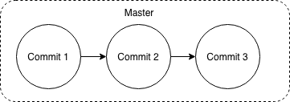
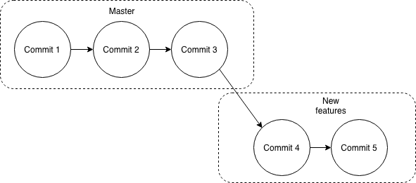
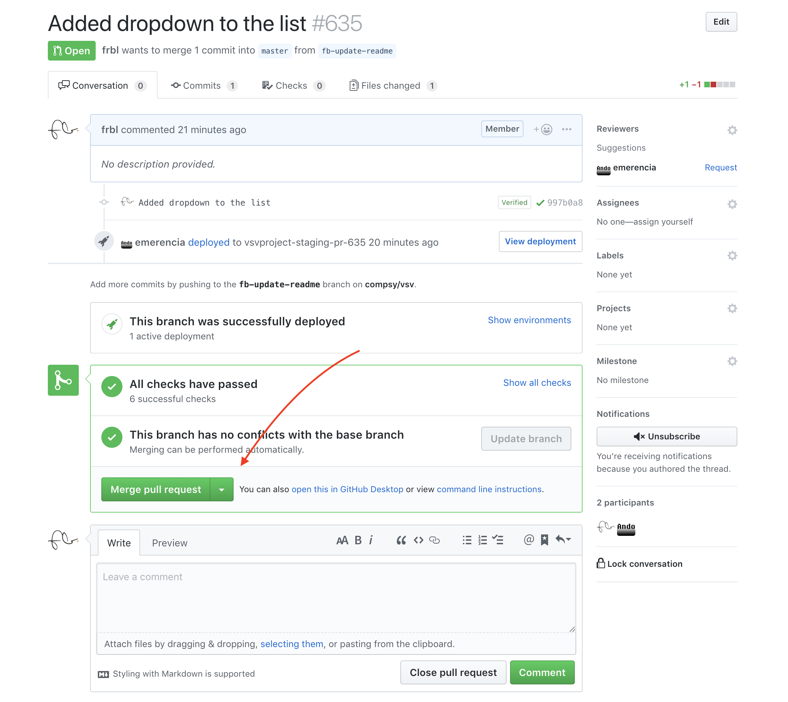
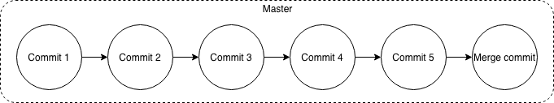

name: inverse
layout: true
class: center, middle, inverse

---
# Git(Hub) Workshop

### Ando Emerencia and Frank Blaauw
#### University of Groningen,<br/>Developmental Psychology / Computer Science

---
layout: false

# Outline

- Why do I need git?
- Introduction to git and GitHub
- How do we use git?
- Hands-on workshop

---

# Why do I need git?

- Code History 
  - _no more `script_final.R`, `script_finalDEF.R`, `script_finalDEFV2.R`_

- Reverting changes 
  - _rolling back to an earlier, working version_

- Collaborating with colleagues
  - _sharing code without difficult merges and usb-sticks_

- Code review 
  - _check each other's code to guarantee code quality_

---

# For what is git useful?

- Version Control System
- Managing plain text files (R syntax, Matlab files, source code, txt files)
  
  
# For what is git not useful?

- Managing microsoft office documents
- Storing data

???
- Git is a version management system, which means that it can keep track of earlier versions of your source code / documents.
- With plain text files we mean anything that is readable from notepad (generally source code or simple files). Not binaries.

---

# The git basics

.pull-left[
  ## Discussed now
  - Repositories
  - Clone
  - Pull
  - Add
  - Commit
  - Push
  - Branches and pull-requests
]

--

.pull-right[
  ## Not discussed now
  - Checkouts
  - Rebasing
  - Cherry-picking
  - Tags
  - Forks
]

???
Each of these will be covered in more detail. The items on the right are added for reference only.

---

# Repositories

.center[
  ![Git flow][git-flow-image]
]

- (Cloud hosted) remote location containing your code
- GitHub is a provider of hosted git repositories
- Repository can be either _private_ (just for you) or _public_ (for everyone)

???

---

# Clone

.center[
  ![Git flow][git-flow-image]
]

- Downloading a remote repository to your local machine
- Only needed once per repository, per machine you need to access your code on
---

# Pull

.center[
  ![Git flow][git-flow-image]
]

- Updating your local working copy with the latest version from the git provider
- Do this every time you want to _pull in_ changes from the remote repository

---

# Add / stage

.center[
  ![Git flow][git-flow-image]
]

- Selecting files / changes that you would like to store in git
- You will have to do this every time you want to store changes or files

???
Git follows multiple steps in order to sync your code to a remote repository. It starts with actually selecting which files you'd like to synchronize.

---

# Commit

.center[
  ![Git flow][git-flow-image]
]

- With a commit you can combine all the staged files into a single update
- A commit comes with a commit message. In these messages you can write what you changed and why you changed something

???
With a git commit you actually combine your changes into a single sort of package, to which you provide a useful name.

---

# Push

.center[
  ![Git flow][git-flow-image]
]

- With a push you upload your commits to the git provider (in our case GitHub)
- You have to push in order to share your commits with everyone.

???
Finally you push your local commits to a remote repository, to store them or to share them with the world.

---

# Branching - the master

.center[
  
]

Supposed to be the _stable_ version of the code.

---

# Branching - a feature branch

.center[
  
]

---

# Branching - Pull request

.center.small[
  
]

Moment to _review code_ before merging it to master.

---

# Branching - merged

.center[
  
]

A pull request causes the change to be merged into master.

---

# A basic collaboration workflow

- Clone a repository.
- Create a new branch.
- Make changes in that branch and add / commit / push to GitHub.
- Create a pull request and ask others to review the changes.
- If changes are ok, merge the branch into master.

---

# Other, more advanced topics (not discussed today)

- Git has a powerful command line interface
- You can use public / private key SSH keys instead of using a username and password
- GitHub can be combined with various services for automatically performing running tests on the code in GitHub (e.g., CircleCI)

---

name: inverse
layout: true
class: center, middle, inverse
---
# Hands on
---

layout: false

# Signing in to MyUWP

- Open https://uwp.rug.nl and login
- Click on _Workspace desktop_
- When you are logged in, start the Google Chrome browser
- All the next steps should be performed from within the UWP client.

---

# Creating a GitHub repository

- Log in on https://github.com
- Click on the green _New_ button next to _Repositories_
  - Fill in a name for the repository
  - Description is not necessary
  - Make it a public repository
  - No need to initialize it with anything
  - Click on _Create repository_
- Click on the clipboard button to copy the repository url.

---

# Install git

- Go to https://git-scm.com/download/win and download the installer.
- Keep clicking next until it starts installing.

---

# Configuring R Studio to work with git
- Open the Windows start menu, type: `R studio`
- In R Studio, Open the Tools menu and select Global options
  - Go to Git/SVN
  - Browse to the correct git executable (e.g. _C:/Users/pnumber/AppData/Local/Programs/Git/bin/git.exe_)
  - Click OK
- Close R Studio

---

# Cloning a repository in R Studio

- Open R Studio again
- Go to _File_ and select _New project_
  - Select _Version control_
  - Click on  _Git_
  - Paste the repository URL
  - (optional) change the directory to store the code in
- Click on _Create Project_

---

# Creating a new R file

- Go to _File_, _New File_, _R Script_
- Add some simple R code, e.g.,
```R
print(2 + 2)
```
- Save and choose a filename ending in .R

---

# Adding the new file to git

- Click on the tab named _git_ (right side)
- Click the _Diff_ button to see an overview of the changes
- Check all changed files to __add__ them to the __staging area__ (could take some time)
- Add a descriptive __commit__ message and click _commit_
- Press close when the commit is done
- Now press __push__ to upload the changes to GitHub
- Fill out your username and password

???
- Altijd eerst een diff doen!
- Username and password worden bewaard ie voor de session, dus dat is wel hip

---
name: inverse
layout: true
class: center, middle, inverse
---
# Questions? 

[git-flow-image]: images/git_flow.png


